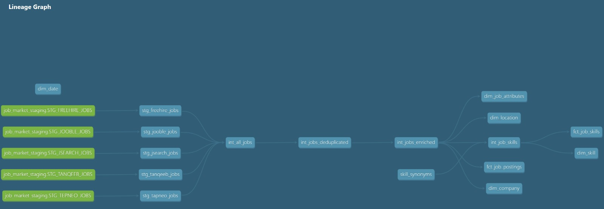
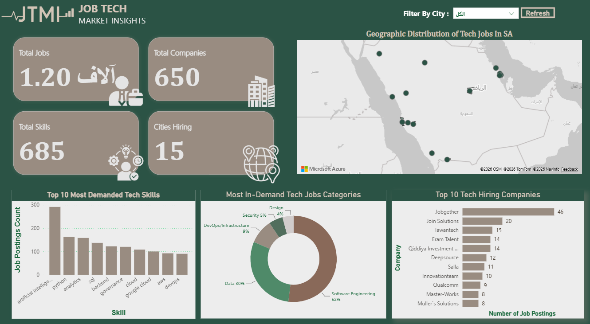

# Job Data Pipeline (Saudi Arabia Tech Market Analytics)

A modular, scalable, and collaborative data pipeline designed to collect, aggregate, and structure tech job market data across Saudi Arabia.

---

## 🏗️ Directory Structure

```
Job-Data-Pipeline/
├── Ingestion/                         <-- Scraper scripts and API fetchers for raw job boards
│   ├── Tanqeeb.py                     
│   ├── freehire.py                    
│   ├── jooble_api.py                  
│   └── jsearch.py                     
│   └── dbt_projects/
│       └── job_pipeline_dbt/          <-- Core dbt project (models, staging, marts, and schema tests)
├── data/                              <-- Medallion architecture storage layers (Bronze, Silver, Gold)
│   ├── final_datasets/                         <-- Gold layer for analytics-ready datasets, aggregates & metrics
│   ├── STAGING/                       <-- Silver layer for cleaned, deduplicated & standardized files
│   └── RAW/                           <-- Bronze layer for raw, untransformed scraper and API dumps
├── .env.example                       <-- Template file outlining required environment variables
├── .gitignore                         
└── README.md                          <-- Project documentation and setup guide                        
```

---

## 📋 Source Inventory & Selection Reasoning

As part of our initial project investigation phase, we evaluated multiple job platforms to establish a robust and comprehensive dataset for the Saudi technology market.


We identified and integrated 5 primary data sources covering the Saudi job market from different collection methods:

| Source | URL/Identifier | Collection Method | Format |
|:---:|:---:|:---:|:---:|
| **Tanqeeb** | https://saudi.tanqeeb.com | Web Scraping | JSON |
| **JSearch** | https://rapidapi.com/letscrape | API with Key | JSON | 
| **FreeHire** | https://freehire.me/jobs | Direct Endpoint | JSON | 
| **Tapneo** | https://tapneo-data.com | File-based source | CSV/JSON 
| **Jooble** | https://sa.jooble.org | API with Key | JSON 


## Selection Reasoning

* **Tanqeeb**:
    * Selected to ensure broad, localized coverage of the Saudi labor market, as it is a prominent local platform offering diverse job listings.

* **JSearch API**:
    * Chosen as a reliable, managed source (REST API) providing structured, consistent data streams, thereby minimizing extraction errors and accelerating data ingestion.

* **FreeHire**:
   * Integrated to specifically target and enrich the dataset with technical job listings.

* **TapNeo**:
   * Included as a historical baseline for testing and to verify the pipeline's capability to handle the import and integration of pre-existing files.

* **Jooble API**:
   * Selected for its regional and global scope, ensuring high accuracy and continuous updates for technical job listings across the Kingdom via its official endpoint.

We implemented a multi-source hybrid extraction strategy combining reliable, structured API providers (Jooble, JSearch, FreeHire) with targeted web scraping (Tanqeeb) and file-based ingestion (Tapneo). This ensures broad coverage of tech job postings across the Kingdom while avoiding platform limitations. Other potential sources with heavy login walls or strict rate limits were dropped after initial access testing.

---
## 📐 Data Modeling & Star Schema Architecture

The Gold layer (`MARTS`) follows a classic Dimensional Modeling (Star Schema) structure to optimize analytical queries and dashboard performance:

* **Fact Job Postings Table** (`fct_job_postings`):
   * Grain: One row per unique job posting, linked to corresponding conformed dimension keys.

* **Fact Job Skills Table / Bridge** (`fct_job_skills`):
   * Grain: One row per (job posting, skill) pair, passing down conformed dimension keys to enable direct filtering and analysis without complex joins.

* **Dimension Tables** (`dim_*`): Company, Location, Date , Skill , and Job Attributes dimensions providing descriptive context.

---

## 🗺️ dbt Documentation & Lineage Graph

To ensure full transparency, modularity, and data lineage tracking across our transformation layers, dbt automatically generates an interactive documentation site and visual dependency graph.

### **Pipeline Lineage Graph**
The graph below illustrates the end-to-end transformation flow—from raw staging sources through intermediate deduplication/enrichment models, all the way to final dimensional marts and facts:



### **Generating Documentation Locally**
You can explore the full interactive documentation and lineage graph locally by running:

```bash
# Navigate to the dbt project directory
cd dbt_projects/job_pipeline_dbt

# Generate the documentation files
dbt docs generate

# Launch the local web server to view the docs UI
dbt docs serve
```
---

## 📊 Dashboard & Analytics Preview

To visualize the modeled Saudi tech job market data, an interactive Power BI dashboard was built connecting directly to our final Star Schema marts. 

👉 **[Explore Live Interactive Power BI Dashboard Here](https://app.powerbi.com/view?r=eyJrIjoiMTdiNGNiMDctMTU4MS00NDJlLTk4NjYtYWJhMWI5MzA5MzY1IiwidCI6ImMyYjA0ZGE2LTg0ODctNDFjYy04ODAzLTkwMzIxMDQ4YTc3MiIsImMiOjl9)**



---

## 📦 Final Datasets & Handover

As per our pipeline handover protocol, structured CSV exports of the final Mart tables are preserved under the [final_datasets/](data/final_datasets/) directory, accompanied by full schema documentation to ensure longevity beyond temporary cloud trials

---
## 🚀 Getting Started

### **1. Clone the Repository**

Clone the project repository to your local machine:

```bash
git clone https://github.com/Leel15/Job-Data-Pipeline.git
cd Job-Data-Pipeline
```

### **2. Install Dependencies**

Install all required Python packages using pip:

```bash
pip install -r requirements.txt
```

### **3. Configure Environment Variables**

Create a file named `.env` in the root project directory (`Job-Data-Pipeline/`), Add your private API keys 


---

## 4. Run the Pipeline & Transformations (dbt)

Navigate into the dbt project directory and execute the data transformations:

```bash
# Install dbt dependencies
dbt deps

# Run models to build Staging, Intermediate, and Marts layers
dbt run

# Execute data quality tests
dbt test
```

---

## ⚠️ Important Notes

- **Never commit `.env`** — it contains sensitive API keys
- **Pull before pushing** to avoid merge conflicts
- **Keep scrapers modular** for easy maintenance and scaling
